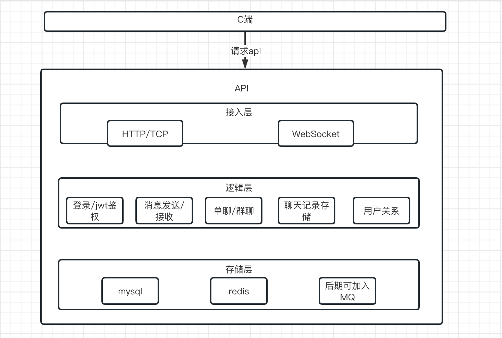
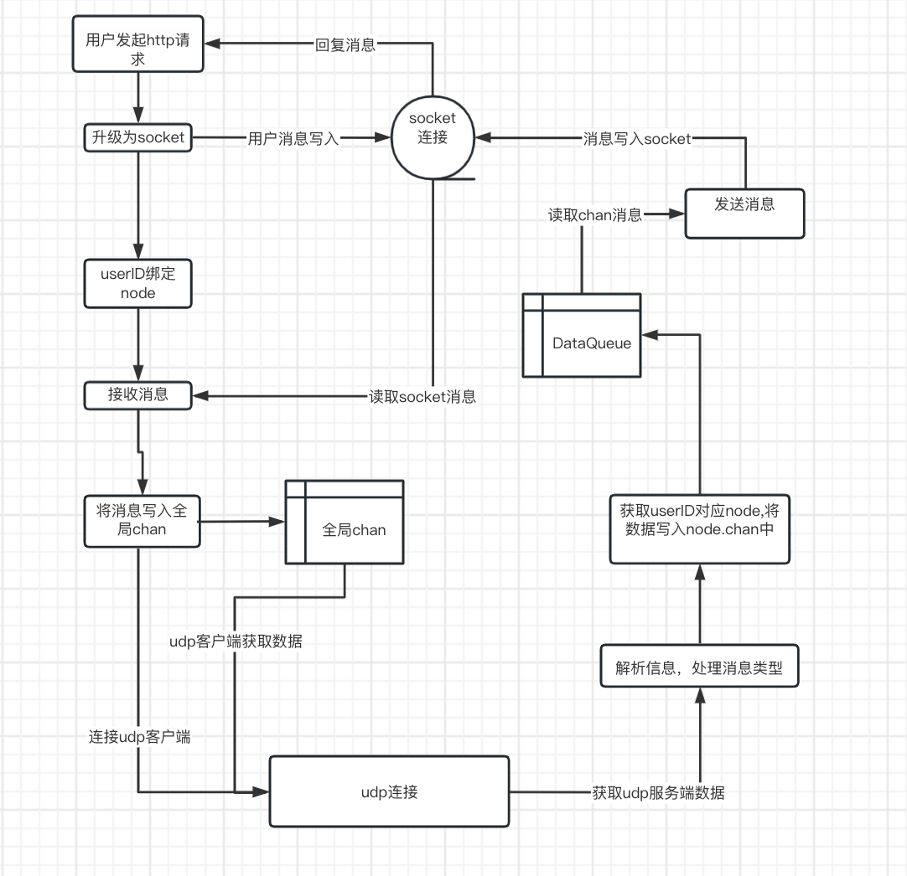

# MyChat

## 概况

参考的项目地址：[《从0到1搭建一个IM项目》](https://learnku.com/articles/74274)

相关技术栈：Go、Gin、Websocket、UDP、Mysql、Redis、Viper、Gorm、Zap、Md5、Jwt

主要功能

- 登录、注册、用户信息更新、账号注销
- 单聊、群聊
- 发送文字、表情包、图片、语音
- 加好友、好友列表、建群、加入群

系统架构


通信流程


项目目录

```
MyChat   
    ├── common    //放置公共文件
    │  
    ├── config    //做配置文件
    │  
    ├── dao       //数据库crud
    │  
    ├── global    //放置各种连接池，配置等
    │   
    ├── initialize  //项目初始化文件
    │  
    ├── middlewear  //放置web中间件
    │ 
    ├── models      //数据库表设计
    │   
    ├── router           //路由
    │   
    ├── service     //对外api
    │   
    ├── test        //测试文件
    │  
    ├── main.go     //项目入口
    ├── go.mod            //项目依赖管理
    ├── go.sum            //项目依赖管理
```

## 初始化

1. 首先创建数据库：

    ```sql
    create database MyChat
    ```

2. 初始化 mod 文件

    ```bash
    go mod init MyChat && go mod tidy
    ```

3. 配置 `/config/config.yaml`

    ```yaml
    port: '8000'
    mysql:
        host: '127.0.0.1'
        port: '3306'
        name: 'MyChat'
        user: 'root'
        password: ''
    redis:
        host: '127.0.0.1'
        port: '6379'
    ```

4. 运行 `main.go`

    ```bash
    go run main.go
    ```

    或者

    ```bash
    go build -o MyChat . && ./MyChat
    ```

最后成功运行就会出现：

``` log
2025-08-26T20:08:10.309+0800    INFO    initialize/config.go:25 配置信息&{8000 {127.0.0.1 3306 MyChat root } {127.0.0.1 6379}}
[GIN-debug] [WARNING] Creating an Engine instance with the Logger and Recovery middleware already attached.

[GIN-debug] [WARNING] Running in "debug" mode. Switch to "release" mode in production.
 - using env:   export GIN_MODE=release
 - using code:  gin.SetMode(gin.ReleaseMode)

[GIN-debug] GET    /v1/user/list             --> MyChat/service.List (4 handlers)
[GIN-debug] POST   /v1/user/login_pw         --> MyChat/service.LoginByNameAndPassWord (3 handlers)
[GIN-debug] POST   /v1/user/new              --> MyChat/service.NewUser (3 handlers)
[GIN-debug] DELETE /v1/user/delete           --> MyChat/service.DeleteUser (4 handlers)
[GIN-debug] POST   /v1/user/updata           --> MyChat/service.UpdataUser (4 handlers)
[GIN-debug] GET    /v1/user/SendUserMsg      --> MyChat/service.SendUserMsg (4 handlers)
[GIN-debug] POST   /v1/relation/list         --> MyChat/service.FriendList (4 handlers)
[GIN-debug] POST   /v1/relation/add          --> MyChat/service.AddFriendByName (4 handlers)
[GIN-debug] POST   /v1/relation/new_group    --> MyChat/service.NewGroup (4 handlers)
[GIN-debug] POST   /v1/relation/group_list   --> MyChat/service.GroupList (4 handlers)
[GIN-debug] POST   /v1/relation/join_group   --> MyChat/service.JoinGroup (4 handlers)
[GIN-debug] POST   /v1/upload/image          --> MyChat/service.Image (3 handlers)
[GIN-debug] POST   /v1/user/redisMsg         --> MyChat/service.RedisMsg (3 handlers)
[GIN-debug] [WARNING] You trusted all proxies, this is NOT safe. We recommend you to set a value.
Please check https://pkg.go.dev/github.com/gin-gonic/gin#readme-don-t-trust-all-proxies for details.
[GIN-debug] Listening and serving HTTP on :8080
```

就可以直接访问服务了，具体的搭建请参考上面的博客。

## benchmark

### Mysql

1. BenchmarkCreateUser

    ```log
    Running tool: /usr/local/go/bin/go test -benchmem -run=^$ -bench ^BenchmarkCreateUser$ MyChat/dao

    goos: linux
    goarch: amd64
    pkg: MyChat/dao
    cpu: 12th Gen Intel(R) Core(TM) i7-12700H
    BenchmarkCreateUser-20    	     164	   7911238 ns/op	   10884 B/op	     103 allocs/op
    PASS
    ok  	MyChat/dao	2.185s
    ```

2. BenchmarkFindUserByName：

```log
Running tool: /usr/local/go/bin/go test -benchmem -run=^$ -bench ^BenchmarkFindUserByName$ MyChat/dao

goos: linux
goarch: amd64
pkg: MyChat/dao
cpu: 12th Gen Intel(R) Core(TM) i7-12700H
BenchmarkFindUserByName-20    	    2062	   1412352 ns/op	    8491 B/op	     125 allocs/op
PASS
ok  	MyChat/dao	25.205s
```

3. BenchmarkFindUserByName（可能需要添加数据）

```log
Running tool: /usr/local/go/bin/go test -benchmem -run=^$ -bench ^BenchmarkAddFriend$ MyChat/dao
2025/08/28 21:55:02 /home/liurun/go_projects/MyChat/dao/relation.go:54 record not found
[1.849ms] [rows:0] SELECT * FROM `relations` WHERE (owner_id = 10745 and target_id = 10646 and type = 1) AND `relations`.`deleted_at` IS NULL ORDER BY `relations`.`id` LIMIT 1
     105	   9983442 ns/op	   29488 B/op	     383 allocs/op
PASS
ok  	MyChat/dao	4.293s
```